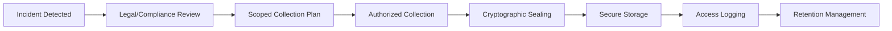

# AFDP for Business: Enterprise Forensic Evidence Platform

## 🏢 Post-Incident Investigation and Compliance Documentation

The AI-Ready Forensic Deployment Pipeline (AFDP) provides enterprises with **forensic-grade evidence collection and preservation** capabilities for post-incident investigations, compliance auditing, and legal defense.

**Core Principle**: AFDP follows git forensics methodology - creating tamper-evident, timestamped records that can be independently verified. This is NOT surveillance, but rather a tool for preserving evidence when incidents occur.

---

## 💼 Legitimate Business Use Cases

### **Post-Incident Investigation**
When security incidents, compliance violations, or legal issues arise, AFDP helps preserve and analyze evidence:

#### Intellectual Property Protection
- **Post-Breach Analysis** - After detecting IP theft, analyze repository access patterns to understand scope
- **Evidence Preservation** - Create cryptographically-signed snapshots of code repositories for legal proceedings
- **Chain of Custody** - Maintain forensic integrity of digital evidence for court admissibility
- **Expert Witness Support** - Generate defensible technical reports for litigation

**Real Scenario**: After discovering a former employee took proprietary code, use AFDP to create a forensic timeline of their repository access, preserving evidence for legal action.

#### Security Incident Response
- **Breach Investigation** - Analyze how attackers moved through systems after detection
- **Root Cause Analysis** - Understand security failures to prevent recurrence  
- **Compliance Reporting** - Document incident response for regulatory requirements
- **Insurance Claims** - Provide evidence for cyber insurance claims

### **Compliance Documentation**
Proactive documentation for regulatory requirements:

#### Financial Services Compliance
- **Audit Trail Creation** - Generate immutable logs of financial system changes
- **Regulatory Reporting** - Automated evidence collection for SOX, FINRA audits
- **Change Management** - Document all modifications to trading algorithms
- **Access Control Logs** - Cryptographically signed records of who accessed what

#### Healthcare Compliance
- **HIPAA Audit Logs** - Tamper-proof records of patient data access
- **Clinical Trial Documentation** - Immutable records of research data changes
- **Incident Documentation** - Preserve evidence of how breaches occurred
- **Compliance Demonstration** - Prove adherence to security protocols

### **Legal Defense Support**
When facing litigation, preserve evidence properly:

- **Litigation Hold** - Automatically preserve relevant repositories when litigation is anticipated
- **eDiscovery Support** - Search and produce documents with verified timestamps
- **Tampering Detection** - Prove documents haven't been altered since creation
- **Witness Corroboration** - Technical evidence to support testimony

---

## 🔒 Privacy-First Architecture

### **Data Minimization Principles**
- **Selective Collection** - Only collect data relevant to specific incidents or compliance needs
- **Purpose Limitation** - Data used only for stated investigation/compliance purposes
- **Retention Limits** - Automatic deletion after legal/compliance requirements met
- **Access Controls** - Strict role-based access with audit trails

### **Employee Privacy Protection**
```yaml
privacy_controls:
  consent_required: true
  data_minimization: enforced
  purpose_limitation: strict
  encryption: 
    at_rest: AES-256
    in_transit: TLS 1.3
  access_logging: comprehensive
  retention_policy:
    default: 90_days
    legal_hold: as_required
    automatic_deletion: enabled
```

### **Ethical Guidelines**
1. **Proportionality** - Collection scope must match incident severity
2. **Transparency** - Clear policies on what, when, and why data is collected
3. **Accountability** - Named individuals responsible for collection decisions
4. **Necessity** - Must demonstrate why evidence is needed
5. **Legal Compliance** - Follow all privacy laws (GDPR, CCPA, etc.)

---

## 📊 Technical Implementation

### **Git Forensics Methodology**
Following the principles from gitforensics.org:

1. **Immutable History** - Every change creates a permanent, timestamped record
2. **Cryptographic Integrity** - SHA-256 hashes ensure tampering is detectable
3. **Distributed Verification** - Multiple copies prevent single point of failure
4. **Public Witnessing** - Optional public commits for transparency

### **Evidence Collection Pipeline**


### **Key Differentiators from Surveillance**
- **Incident-Driven** - Not continuous monitoring
- **Legally Authorized** - Proper approval before collection
- **Purpose-Limited** - Specific investigation goals
- **Time-Bounded** - Clear start and end dates
- **Auditable** - All actions logged and reviewable

---

## 🚀 Implementation Best Practices

### **Deployment Checklist**
1. [ ] Establish clear data governance policies
2. [ ] Define incident response procedures
3. [ ] Train staff on privacy requirements
4. [ ] Implement access controls
5. [ ] Configure retention policies
6. [ ] Set up audit logging
7. [ ] Test evidence integrity procedures
8. [ ] Establish legal review process

### **Sample Configuration**
```yaml
afdp_business_config:
  mode: "incident_response"  # Not continuous monitoring
  
  collection_triggers:
    - security_incident_detected
    - compliance_audit_requested
    - litigation_hold_issued
    - regulatory_investigation
  
  privacy_safeguards:
    employee_notification: required
    purpose_documentation: mandatory
    retention_limit: 90_days
    access_approval: two_person_rule
  
  evidence_handling:
    encryption: required
    integrity_checks: sha256
    chain_of_custody: enforced
    tampering_detection: enabled
```

---

## 💡 Key Benefits

### **Defensible Evidence**
- Court-admissible digital evidence
- Tamper-evident storage
- Verifiable timestamps
- Expert witness support

### **Reduced Legal Risk**
- Proper evidence preservation
- Compliance documentation
- Incident response records
- Litigation preparedness

### **Operational Excellence**
- Faster incident investigation
- Better root cause analysis
- Improved compliance posture
- Reduced insurance premiums

---

## ⚖️ Legal and Ethical Framework

### **Compliance with Privacy Laws**
- **GDPR Article 6** - Lawful basis for processing
- **CCPA Rights** - Respect consumer privacy rights
- **Employee Privacy** - Follow local employment laws
- **Cross-Border** - Comply with data transfer regulations

### **Governance Structure**
```
┌─────────────────┐
│ Board Oversight │
└────────┬────────┘
         │
┌────────▼────────┐
│ Privacy Officer │
└────────┬────────┘
         │
┌────────▼────────┐
│ Security Team   │
└────────┬────────┘
         │
┌────────▼────────┐
│ Incident Resp.  │
└─────────────────┘
```

---

## 📞 Getting Started

### **Pilot Program Approach**
1. **Define Scope** - Start with one department or system
2. **Set Policies** - Clear rules on collection and use
3. **Train Staff** - Ensure everyone understands the purpose
4. **Test Procedures** - Verify evidence collection works
5. **Review Results** - Assess effectiveness and privacy impact

### **Contact**
For more information about implementing AFDP for legitimate business forensics:
- Email: owner@caiatech.com
- Documentation: https://github.com/Caia-Tech/afdp

---

**Important Note**: AFDP is designed for legitimate post-incident investigation and compliance documentation, not surveillance. All features are built with privacy protection and legal compliance as core requirements.

**Built by Caia Tech**  
*Forensic evidence for business protection*