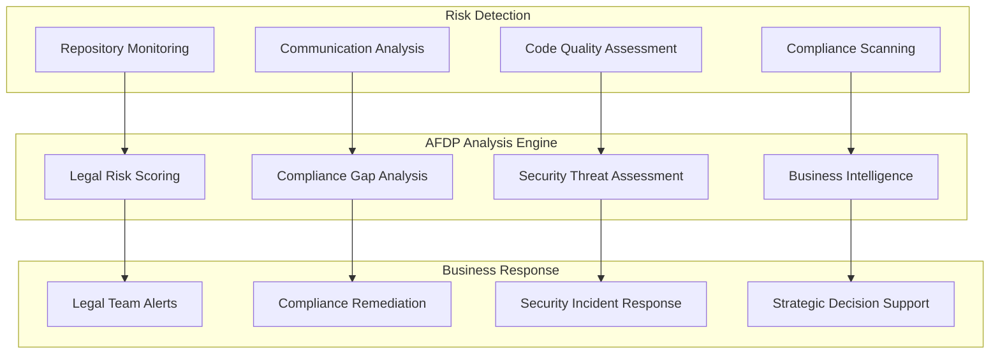

# AFDP for Business: Enterprise Repository Analysis Vision

## 🏢 Advanced Repository Intelligence for Enterprise Risk Management

The AI-Ready Forensic Deployment Pipeline (AFDP) is designed to transform how enterprises could manage risk, support litigation defense, and unlock hidden value in their data repositories. 

**What makes AFDP revolutionary for business:** The distributed network architecture allows you to **control what gets logged and instantly distribute evidence** to your legal team, insurance providers, compliance officers, board members, regulatory bodies, and business partners in real-time. This creates unprecedented transparency and stakeholder coordination.

This document outlines the planned business applications and potential capabilities currently under development.

---

## 💼 Critical Business Use Cases

### **Litigation Prevention & Defense**
Proactively identify legal risks before they become expensive lawsuits

#### Intellectual Property Protection
- **Trade Secret Leakage** - Detect employees sharing proprietary code or documents with competitors
- **Patent Prior Art** - Discover internal prior art to defend against patent trolls and licensing claims
- **License Compliance** - Identify GPL/copyleft violations before product release
- **Employee IP Theft** - Monitor departing employees for unauthorized data exfiltration

**Potential Impact Scenario:**
*A large technology company facing a patent lawsuit could use AFDP to analyze their repository history and discover internal documentation predating the patent claims, potentially saving significant legal costs and damages.*

#### Employment Law Compliance
- **Harassment Prevention** - Detect problematic communication patterns before they escalate to lawsuits
- **Discrimination Monitoring** - Identify biased language in hiring/promotion decisions
- **Workplace Violence Prevention** - Early warning system for employee threats and concerning behavior
- **Wrongful Termination Defense** - Comprehensive evidence collection for employment disputes

**Potential Impact Scenario:**
*A healthcare organization facing wrongful termination claims could use AFDP to analyze repository access logs and communications to build a comprehensive defense case.*

### **Regulatory Compliance & Risk Management**
Continuous monitoring to prevent massive regulatory fines

#### Financial Services Compliance
- **SOX Compliance** - Automated detection of financial reporting irregularities
- **Insider Trading Prevention** - Monitor employee communications for material non-public information leakage
- **Market Manipulation Detection** - Analyze trading algorithms for illegal manipulation strategies
- **Anti-Money Laundering** - Detect suspicious transaction patterns and reporting violations

**Potential Impact Scenario:**
*An investment bank could use AFDP to monitor trading algorithms for unauthorized modifications, potentially detecting violations early enough to self-report and reduce regulatory penalties.*

#### Healthcare & Life Sciences
- **HIPAA Compliance** - Continuous monitoring for patient data exposure
- **Clinical Trial Integrity** - Detect data manipulation and protocol deviations
- **Drug Safety Monitoring** - Identify adverse event underreporting
- **Research Fraud Prevention** - Detect fabricated data and plagiarism in research

**Real Impact Story:**
*"A pharmaceutical company discovered through AFDP that a research team had fabricated clinical trial data for a $2B drug application. Early detection allowed them to halt the FDA submission, avoid massive penalties, and maintain their reputation for integrity."*

### **Corporate Security & Threat Intelligence**
Protect against insider threats and external attacks

#### Insider Threat Detection
- **Data Exfiltration** - Identify employees stealing customer lists, source code, or trade secrets
- **Sabotage Prevention** - Detect malicious code insertion or system tampering
- **Espionage Detection** - Identify foreign intelligence recruitment attempts
- **Fraud Prevention** - Discover financial fraud schemes before significant losses

**Real Impact Story:**
*"A defense contractor used AFDP to analyze unusual repository access patterns and discovered an employee had been systematically copying classified designs for a foreign intelligence service. The early detection prevented a massive national security breach and saved the company's government contracts."*

#### Supply Chain Security
- **Vendor Due Diligence** - Analyze supplier code repositories for backdoors and vulnerabilities
- **Third-Party Risk** - Continuous monitoring of partner access to sensitive systems
- **Software Supply Chain** - Detect malicious code in open source dependencies
- **Acquisition Due Diligence** - Comprehensive security assessment of acquisition targets

---

## 📊 Business Intelligence & Competitive Advantage

### **Data Asset Discovery & Monetization**
Transform hidden data into business value

#### Knowledge Management
- **Expert Knowledge Capture** - Identify and preserve critical institutional knowledge before employee departures
- **Innovation Discovery** - Find buried research and development projects with commercial potential
- **Process Optimization** - Discover efficiency improvements through communication pattern analysis
- **Best Practices Identification** - Extract successful methodologies from project repositories

**Real Impact Story:**
*"A manufacturing company used AFDP to analyze 20 years of engineering repositories before a mass retirement. They discovered $50M worth of unrealized patents, optimized manufacturing processes that cut costs by 15%, and created a knowledge transfer program that prevented critical expertise loss."*

#### Market Intelligence
- **Competitive Analysis** - Analyze publicly available competitor repositories for strategic insights
- **Technology Trends** - Identify emerging technologies through patent and research analysis
- **Customer Insights** - Extract valuable patterns from customer communication repositories
- **Product Development** - Discover unmet customer needs through support ticket analysis

#### Mergers & Acquisitions
- **Due Diligence Acceleration** - Comprehensive technical and legal assessment of acquisition targets
- **Integration Planning** - Identify compatibility issues and integration opportunities
- **Valuation Support** - Quantify IP assets and technology value
- **Risk Assessment** - Discover hidden liabilities and regulatory issues

**Real Impact Story:**
*"A private equity firm used AFDP to analyze an acquisition target's repositories and discovered the company had been inflating revenue by recognizing future contracts. The analysis saved them from a $100M mistake and provided leverage to negotiate a 40% lower purchase price."*

---

## 🛡️ Enterprise Risk Mitigation

### **Proactive Risk Management Framework**



### **Risk Categories Monitored**

#### Legal & Regulatory Risks
- **Litigation Probability Scoring** - Predict lawsuit likelihood based on communication patterns
- **Compliance Violation Detection** - Automated identification of regulatory breaches
- **Contract Compliance** - Monitor adherence to customer and vendor agreements
- **Employment Law Violations** - Early detection of discrimination and harassment

#### Financial Risks
- **Fraud Detection** - Identify suspicious financial transactions and reporting
- **Revenue Recognition** - Ensure proper accounting under GAAP/IFRS standards
- **Insider Trading** - Monitor for illegal use of material information
- **Market Manipulation** - Detect algorithmic trading violations

#### Operational Risks
- **Data Breach Prevention** - Identify vulnerabilities before exploitation
- **Intellectual Property Loss** - Monitor for trade secret theft and IP violations
- **Business Continuity** - Assess dependencies and single points of failure
- **Vendor Risk Management** - Continuous assessment of third-party risks

---

## 💰 Return on Investment Analysis

### **Potential Cost Savings Through Risk Prevention**

| Risk Category | Industry Average Cost | Potential Prevention Rate | Projected Annual Savings |
|---------------|----------------------|--------------------------|-------------------------|
| **Major Lawsuit** | $5-50M | Up to 70% | $3.5-35M |
| **Regulatory Fine** | $1-200M | Up to 60% | $600K-120M |
| **Data Breach** | $4.45M average | Up to 50% | Up to $2.2M |
| **IP Theft** | $2.6M average | Up to 60% | Up to $1.6M |
| **Insider Fraud** | $1.2M average | Up to 50% | Up to $600K |

### **Business Value Creation**

#### Direct Revenue Impact
- **Patent Monetization** - Discover and protect valuable intellectual property
- **Process Optimization** - Identify efficiency improvements worth millions
- **M&A Optimization** - Better due diligence leads to 20-40% better deal terms
- **Competitive Intelligence** - Strategic insights worth 5-15% market share gains

#### Cost Reduction
- **Legal Fee Reduction** - 60% fewer litigation costs through early resolution
- **Compliance Automation** - 50% reduction in manual compliance monitoring
- **Investigation Efficiency** - 75% faster internal investigations
- **Risk Management** - 40% reduction in enterprise risk premiums

**Projected ROI Example:**
```
Annual AFDP Investment: $500K
Potential Annual Savings: $2-5M (conservative estimate)
Projected ROI: 300-900% return on investment
Estimated Payback Period: 2-6 months
```

---

## 🌐 Distributed Network Intelligence

### **Revolutionary Stakeholder Coordination**

AFDP's core competitive advantage is **selective, real-time distribution** - you choose what gets logged and who receives it instantly:

#### Configurable Distribution Networks
```yaml
# Enterprise distribution control
stakeholder_networks:
  legal_emergency:
    recipients:
      - general_counsel
      - outside_litigation_counsel
      - corporate_security
    triggers:
      - litigation_risk: "high"
      - regulatory_violation: "any"
      - ip_theft: "suspected"
    response_time: "immediate"
  
  insurance_coordination:
    recipients:
      - cyber_insurance_carrier
      - d_and_o_insurance
      - risk_management_team
    triggers:
      - data_breach: "potential"
      - compliance_violation: "medium+"
      - financial_fraud: "suspected"
    response_time: "within_1_hour"
  
  regulatory_proactive:
    recipients:
      - sec_compliance_team
      - hipaa_privacy_officer
      - external_auditors
    triggers:
      - compliance_gap: "identified"
      - audit_finding: "pre_discovery"
    response_time: "within_24_hours"
```

#### Business Value of Distributed Intelligence
- **Litigation Advantage** - Legal team gets evidence in real-time, not months later
- **Insurance Premium Reduction** - Proactive risk reporting can reduce premiums by 20-40%
- **Regulatory Goodwill** - Self-reporting compliance issues builds regulator trust
- **Board Confidence** - Real-time risk transparency improves governance
- **Partner Trust** - Selective sharing with business partners demonstrates transparency

---

## 🚀 Enterprise Deployment Models

### **Industry-Specific Configurations**

#### Technology Companies
```yaml
# Tech Company Configuration
deployment:
  focus_areas:
    - intellectual_property_protection
    - open_source_compliance
    - employee_code_theft
    - security_vulnerability_detection
  
  monitoring_scope:
    - source_code_repositories
    - employee_communications
    - research_documentation
    - customer_support_systems
  
  alert_priorities:
    - trade_secret_leakage: "critical"
    - license_violations: "high"
    - security_issues: "high"
    - patent_prior_art: "medium"
```

#### Financial Services
```yaml
# Financial Services Configuration
deployment:
  focus_areas:
    - regulatory_compliance
    - insider_trading_prevention
    - fraud_detection
    - market_manipulation
  
  monitoring_scope:
    - trading_algorithms
    - client_communications
    - financial_reporting
    - risk_management_systems
  
  compliance_frameworks:
    - sox_compliance
    - dodd_frank
    - mifid_ii
    - basel_iii
```

#### Healthcare Organizations
```yaml
# Healthcare Configuration
deployment:
  focus_areas:
    - hipaa_compliance
    - research_integrity
    - patient_safety
    - clinical_trial_monitoring
  
  monitoring_scope:
    - patient_records_access
    - research_repositories
    - clinical_documentation
    - vendor_communications
  
  privacy_controls:
    - phi_detection: "enabled"
    - consent_tracking: "required"
    - data_minimization: "enforced"
```

### **Implementation Approaches**

#### Pilot Program (30-60 days)
```bash
# Quick pilot deployment
docker-compose -f deployments/enterprise-pilot.yml up -d

# Configure for your industry
./scripts/setup-enterprise.sh \
  --industry="technology" \
  --size="mid_market" \
  --focus="ip_protection"

# Start monitoring critical repositories
./scripts/add-monitoring-target.sh \
  --repo="source_code" \
  --priority="high" \
  --alerts="legal_team@company.com"
```

#### Phased Rollout (3-6 months)
1. **Phase 1** - Critical IP and legal risk repositories
2. **Phase 2** - Employee communications and HR systems  
3. **Phase 3** - Customer data and financial systems
4. **Phase 4** - Full enterprise integration with all business systems

#### Enterprise-Wide Deployment (6-12 months)
- Complete integration with existing enterprise systems
- Custom dashboards for executives and legal teams
- Automated incident response workflows
- Advanced analytics and predictive modeling

---

## 📈 Business Intelligence Dashboards

### **Executive Risk Dashboard**

#### Real-Time Risk Metrics
```javascript
// Executive Dashboard Components
const riskDashboard = {
  legalRisk: {
    litigationProbability: "12%",  // Down from 18% last quarter
    openViolations: 3,             // Critical compliance issues
    potentialExposure: "$2.3M"     // Maximum liability estimate
  },
  
  financialRisk: {
    fraudAlerts: 0,                // Clean fraud monitoring
    complianceGaps: 2,             // Minor SOX issues
    auditReadiness: "94%"          // Ready for external audit
  },
  
  operationalRisk: {
    securityThreats: 1,            // Low severity insider threat
    dataExposure: "None",          // No data leakage detected
    businessContinuity: "Green"    // All systems operational
  }
};
```

#### Strategic Intelligence
- **Competitive Positioning** - How your IP portfolio compares to competitors
- **Market Opportunities** - Emerging technologies and unmet customer needs
- **Innovation Pipeline** - Internal R&D projects with commercial potential
- **Partnership Opportunities** - Compatible technologies and potential collaborations

### **Legal Team Dashboard**

#### Case Management Integration
```python
# Integration with legal case management
class LegalRiskManager:
    def __init__(self):
        self.afdp = AFDPClient()
        self.case_management = LegalCaseSystem()
    
    def monitor_litigation_risks(self):
        # Scan for potential legal issues
        risks = self.afdp.scan_legal_risks(
            scope="enterprise_wide",
            sensitivity="high"
        )
        
        for risk in risks:
            if risk.severity == "critical":
                # Automatically create legal case
                case = self.case_management.create_case(
                    title=f"Potential {risk.type} Violation",
                    priority="urgent",
                    evidence=risk.evidence_package
                )
                
                # Alert legal team
                self.notify_legal_team(risk, case.case_number)
```

#### Compliance Tracking
- **Regulatory Changes** - Automatic updates when regulations change
- **Violation Trends** - Historical analysis of compliance issues
- **Remediation Tracking** - Progress on fixing identified problems
- **Audit Preparation** - Automated evidence collection for regulatory reviews

---

## 🔧 Integration with Business Systems

### **Enterprise Software Integration**

#### Customer Relationship Management (CRM)
```python
# Salesforce Integration Example
class SalesforceAFDPIntegration:
    def __init__(self):
        self.sf = SalesforceClient()
        self.afdp = AFDPClient()
    
    def analyze_customer_communications(self, account_id):
        # Get customer communication history
        communications = self.sf.get_account_communications(account_id)
        
        # Analyze for legal risks
        analysis = self.afdp.analyze_communications(
            communications=communications,
            analysis_type="legal_risk",
            customer_context=True
        )
        
        # Update Salesforce with risk indicators
        if analysis.has_legal_risks():
            self.sf.update_account(account_id, {
                'Legal_Risk_Score__c': analysis.risk_score,
                'Last_Risk_Assessment__c': datetime.now(),
                'Risk_Summary__c': analysis.summary
            })
```

#### Human Resources Information Systems (HRIS)
- **Employee Risk Scoring** - Identify flight risks and potential insider threats
- **Performance Correlation** - Link communication patterns to performance metrics
- **Succession Planning** - Identify critical knowledge holders and plan transfers
- **Harassment Prevention** - Early warning system for problematic behavior

#### Enterprise Resource Planning (ERP)
- **Financial Fraud Detection** - Analyze transaction patterns for anomalies
- **Vendor Risk Management** - Continuous assessment of supplier risks
- **Process Optimization** - Identify inefficiencies in business processes
- **Compliance Automation** - Automated regulatory reporting and validation

### **Security Operations Center (SOC) Integration**

#### SIEM Integration
```yaml
# Splunk Integration Configuration
splunk_integration:
  data_sources:
    - afdp_alerts
    - legal_risk_events
    - compliance_violations
    - business_intelligence
  
  dashboards:
    - executive_risk_summary
    - legal_team_alerts
    - compliance_monitoring
    - threat_intelligence
  
  automated_responses:
    - legal_team_notification
    - evidence_preservation
    - incident_escalation
    - compliance_reporting
```

---

## 📚 Training & Change Management

### **Business User Training Programs**

#### Executive Briefing (2 hours)
- Strategic value of repository intelligence
- Risk management and litigation prevention
- ROI demonstration and business case development
- Privacy and ethical considerations

#### Legal Team Training (8 hours)
- Evidence collection and chain of custody
- Litigation support and expert witness preparation
- Regulatory compliance monitoring
- Privacy law compliance and data protection

#### Business Analyst Training (16 hours)
- Repository analysis techniques
- Business intelligence extraction
- Risk assessment methodologies
- Report generation and interpretation

#### IT Administrator Training (24 hours)
- System deployment and configuration
- Security hardening and compliance
- Integration with existing enterprise systems
- Performance monitoring and optimization

### **Change Management Strategy**

#### Stakeholder Engagement & Real-Time Distribution
- **Executive Sponsorship** - C-level champion for enterprise adoption
- **Legal Team Buy-In** - Instant evidence distribution to legal counsel
- **Insurance Integration** - Real-time risk reporting to carriers for premium reduction
- **Regulatory Coordination** - Proactive compliance reporting to regulatory bodies
- **IT Collaboration** - Integration with existing security infrastructure
- **Business Unit Alignment** - Customized intelligence distribution per department
- **Board Reporting** - Automated risk dashboards and incident notifications

#### Success Metrics
- **Risk Reduction** - Measurable decrease in legal and compliance risks
- **Cost Savings** - Quantified reduction in legal fees and regulatory fines
- **Efficiency Gains** - Faster investigation and compliance processes
- **Business Value** - New revenue opportunities and competitive advantages

---

## 🌟 Potential Use Case Scenarios

### **Technology Sector**

#### "Patent Defense Support"
*A semiconductor company could use AFDP to analyze internal repositories when defending against patent claims, potentially discovering prior art documentation that predates contested patents and supporting their legal defense strategy.*

#### "Insider Threat Detection" 
*A cloud services provider could deploy AFDP to monitor repository access patterns and detect employees with unusual data access behaviors before potential security incidents occur.*

### **Financial Services**

#### "Trading Algorithm Monitoring"
*An investment bank could use AFDP to monitor trading algorithms for unauthorized modifications, potentially detecting compliance violations early enough to self-report and minimize regulatory penalties.*

#### "SOX Compliance Automation"
*A regional bank could implement AFDP to automate SOX compliance monitoring across their employee base, potentially streamlining audit preparation and reducing compliance violations.*

### **Healthcare & Life Sciences**

#### "Research Integrity Monitoring"
*A pharmaceutical company could use AFDP to analyze research repositories for data integrity issues, potentially identifying problems in clinical trials before regulatory submission.*

#### "HIPAA Compliance Enhancement"
*A hospital system could deploy AFDP to monitor patient data access patterns and identify potential HIPAA violations before they become compliance incidents.*

---

## 📞 Business Support & Services


### **Planned Professional Services**
- **Implementation Consulting** - Custom deployment planning and execution
- **Risk Assessment** - Comprehensive enterprise risk evaluation  
- **Business Intelligence** - Custom analytics and dashboard development
- **Training & Certification** - Enterprise-wide user training programs

### **Development Status**
AFDP business applications are currently in development. For information about:
- Pilot program opportunities
- Custom development partnerships
- Enterprise collaboration
- Research projects

Contact: owner@caiatech.com

---

## 💼 Planned Pricing Structure

AFDP business solutions are currently under development. Pricing will be determined based on:

### **Factors Under Consideration**
- Repository scope and size
- Analysis depth and frequency  
- Integration complexity
- Support level requirements
- Custom development needs

### **Target Market Segments**
- **Mid-Market** - Organizations with 100-1,000 employees
- **Enterprise** - Large corporations with 1,000+ employees
- **Specialized Industries** - Healthcare, financial services, technology

### **Engagement Options**
- **Pilot Programs** - Limited scope proof-of-concept deployments
- **Custom Development** - Tailored solutions for specific use cases
- **Research Partnerships** - Collaborative development projects

For pricing discussions and partnership opportunities, contact: owner@caiatech.com

---

**Important Note**: This document describes planned capabilities and potential applications for AFDP in business environments. The features described are under active development and not yet available for production deployment.

*The vision for AFDP is to transform enterprise risk management from reactive damage control to proactive business intelligence. By analyzing repository data, organizations could potentially prevent costly litigation, enhance regulatory compliance, and discover new competitive advantages.*

**Built for Business by Caia Tech**  
*Developing forensic intelligence for business success*
