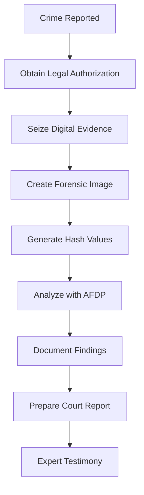

# AFDP Public Safety: Digital Forensics for Law Enforcement

## 🛡️ Evidence-Based Investigation Support

The AI-Ready Forensic Deployment Pipeline (AFDP) provides law enforcement with **forensic-grade digital evidence collection** capabilities for criminal investigations, following established legal procedures and constitutional requirements.

**Core Principle**: AFDP implements git forensics methodology for law enforcement - creating court-admissible, tamper-evident digital evidence with proper chain of custody. This is an investigation tool, not a surveillance system.

---

## 🚨 Legitimate Law Enforcement Use Cases

### **Criminal Investigation Support**
AFDP assists in analyzing digital evidence AFTER crimes are reported or suspected:

#### Digital Evidence Analysis
- **Device Forensics** - Analyze seized devices following proper warrant procedures
- **Timeline Reconstruction** - Build accurate sequences of events from digital artifacts
- **Data Recovery** - Retrieve deleted files while maintaining evidence integrity
- **Communication Analysis** - Examine messages related to specific criminal investigations

#### Investigation Types Supported
- **Cybercrime** - Analyze malware, track cryptocurrency, investigate hacking
- **Financial Crimes** - Trace money laundering, document fraud schemes
- **Violent Crimes** - Digital evidence supporting traditional investigations
- **Organized Crime** - Map criminal networks through court-authorized data

**Key Requirement**: All analysis requires proper legal authorization (warrant, subpoena, or consent).

### **Forensic Best Practices**
Following National Institute of Justice guidelines:

1. **Legal Authorization First** - Obtain warrants before accessing private data
2. **Chain of Custody** - Document every evidence handling step
3. **Write Protection** - Prevent accidental evidence modification
4. **Verification** - Cryptographic hashes ensure integrity
5. **Documentation** - Detailed logs of all investigative actions

---

## ⚖️ Constitutional Safeguards

### **Fourth Amendment Compliance**
```yaml
constitutional_requirements:
  search_warrant:
    required_for: private_data_analysis
    specificity: must_describe_data_sought
    probable_cause: required
    judicial_review: mandatory
  
  exceptions:
    consent: documented_voluntary_consent
    exigent_circumstances: imminent_danger_only
    plain_view: inadvertent_discovery
```

### **Privacy Protection Measures**
- **Scope Limitation** - Only analyze data covered by warrant
- **Minimization** - Avoid collecting irrelevant personal data
- **Segregation** - Separate privileged communications
- **Audit Trails** - Log all access for judicial review
- **Time Limits** - Warrants specify collection periods

### **Exclusionary Rule Compliance**
- Invalid authorization = evidence inadmissible
- Exceeding scope = evidence excluded
- Chain of custody breaks = evidence questioned
- Privacy violations = case dismissal risk

---

## 🔍 Technical Implementation

### **Digital Forensics Workflow**


### **Evidence Integrity Features**
```rust
pub struct ForensicEvidence {
    pub case_number: String,
    pub authorization: LegalAuthorization,
    pub chain_of_custody: Vec<CustodyEntry>,
    pub hash_verification: CryptographicHash,
    pub write_blocker: WriteProtection,
}

impl ForensicEvidence {
    pub fn verify_integrity(&self) -> Result<bool> {
        // Ensure evidence hasn't been tampered with
        self.hash_verification.verify_current_state()
    }
    
    pub fn log_access(&mut self, officer: &Officer) {
        // Maintain chain of custody
        self.chain_of_custody.push(CustodyEntry::new(officer));
    }
}
```

### **Court-Admissible Output**
- **Forensic Reports** - Technical findings in understandable language
- **Expert Affidavits** - Sworn statements about methodology
- **Chain of Custody** - Complete documentation of evidence handling
- **Technical Appendix** - Detailed logs for opposing counsel review

---

## 📊 Investigative Capabilities

### **Supported Analysis Types**

#### Timeline Analysis
- Reconstruct sequences of events
- Correlate activities across devices
- Identify patterns of behavior
- Support alibi verification

#### Network Analysis  
- Map criminal associations (with warrant)
- Identify communication patterns
- Track financial transactions
- Discover hidden relationships

#### Data Recovery
- Retrieve deleted files
- Recover formatted drives
- Extract encrypted data (with legal authority)
- Reconstruct fragmented files

### **NOT Supported** ❌
- Mass surveillance
- Warrantless monitoring  
- Predictive policing based on profiling
- Continuous tracking without authorization
- Fishing expeditions

---

## 🚀 Deployment Guidelines

### **Agency Requirements**
```yaml
deployment_prerequisites:
  policies:
    - digital_evidence_policy
    - privacy_protection_procedures
    - warrant_application_process
    - evidence_retention_rules
  
  training:
    - constitutional_law_refresher
    - digital_forensics_certification
    - chain_of_custody_procedures
    - courtroom_testimony_prep
  
  oversight:
    - internal_affairs_review
    - audit_compliance_checks
    - citizen_oversight_board
    - judicial_monitoring
```

### **Implementation Phases**

#### Phase 1: Policy Development 
- Draft digital evidence policies
- Legal review and approval
- Union negotiations if required
- Public comment period

#### Phase 2: Training Program 
- Train forensic examiners
- Educate investigators
- Brief prosecutors
- Inform leadership

#### Phase 3: Pilot Deployment 
- Limited scope testing
- Process refinement
- Feedback incorporation
- Success metrics evaluation

#### Phase 4: Full Implementation 
- Gradual rollout
- Continuous monitoring
- Regular audits
- Ongoing training

---

## 📚 Training and Certification

### **Required Training Modules**

#### Legal Foundations (16 hours)
- Constitutional requirements
- Search warrant applications  
- Privacy law compliance
- Evidence admissibility rules
- Case law updates

#### Technical Skills (40 hours)
- Digital forensics basics
- AFDP platform operation
- Evidence preservation
- Report generation
- Data interpretation

#### Courtroom Skills (8 hours)
- Expert testimony preparation
- Cross-examination readiness
- Technical explanation skills
- Visual evidence presentation

### **Certification Requirements**
- Pass written examination (80% minimum)
- Complete practical exercises
- Demonstrate legal knowledge
- Maintain annual recertification
- Document continuing education

---

## 🔒 Accountability and Oversight

### **Multi-Layer Oversight Structure**
```
┌─────────────────────┐
│ Judicial Oversight  │ - Warrant approval and compliance
└──────────┬──────────┘
           │
┌──────────▼──────────┐
│ Legislative Review  │ - Policy approval and funding
└──────────┬──────────┘
           │
┌──────────▼──────────┐
│ Citizen Oversight   │ - Community accountability
└──────────┬──────────┘
           │
┌──────────▼──────────┐
│ Internal Affairs    │ - Policy compliance monitoring
└──────────┬──────────┘
           │
┌──────────▼──────────┐
│ Audit Division      │ - Technical and legal audits
└─────────────────────┘
```

### **Transparency Measures**
- Annual public reports on usage
- Aggregated statistics (not individual data)
- Policy documentation publicly available
- Regular community meetings
- Independent research access

### **Accountability Mechanisms**
- Officer discipline for misuse
- Evidence exclusion for violations
- Civil liability for rights violations
- Criminal prosecution if warranted
- System access revocation

---

## 📊 Success Metrics

### **Measure What Matters**
| Metric | Goal | Measurement |
|--------|------|-------------|
| **Case Clearance** | Improve solve rates | % cases with digital evidence |
| **Court Success** | Evidence admissibility | % evidence admitted |
| **Time Efficiency** | Faster investigations | Days to case resolution |
| **Privacy Protection** | Zero violations | Audit findings |
| **Community Trust** | Public confidence | Survey results |

### **Red Flags to Monitor**
- Increasing warrant denials
- Evidence exclusion patterns
- Privacy complaints rising
- Scope creep attempts
- Training compliance drops

---

## 🤝 Community Engagement

### **Building Public Trust**
1. **Transparency** - Clear policies and procedures
2. **Accountability** - Strong oversight mechanisms
3. **Engagement** - Regular community input
4. **Education** - Public awareness programs
5. **Responsiveness** - Address concerns quickly

### **Stakeholder Involvement**
- Civil liberties organizations
- Community representatives
- Legal professionals
- Technical experts
- Victim advocates

---

## 📞 Resources and Support

### **Getting Started**
Agencies interested in implementing proper digital forensics should:

1. Review model policies from IACP and NIJ
2. Consult with prosecutors and legal counsel
3. Engage community stakeholders
4. Develop comprehensive training
5. Establish oversight mechanisms

### **Contact**
For information about AFDP for legitimate law enforcement forensics:
- Email: owner@caiatech.com
- Documentation: https://github.com/Caia-Tech/afdp

---

**Important Note**: AFDP is designed for anyone who is authorized to manage digital forensics, not mass surveillance or predictive policing. All capabilities require proper legal authorization and are subject to constitutional limitations.

**Key Reminder**: The Fourth Amendment requires warrants based on probable cause for searching private digital data. AFDP is a tool for analyzing properly obtained evidence, not circumventing legal requirements.

---

**Built by Caia Tech**  
*Digital forensics for justice, with justice*
