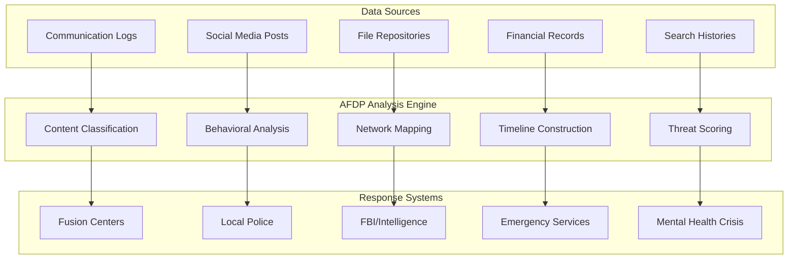

# AFDP Public Safety & Threat Prevention Vision

## 🛡️ Future Capabilities for Community Protection

The AI-Ready Forensic Deployment Pipeline (AFDP) is being designed to provide advanced capabilities for **supporting law enforcement investigations and threat analysis** through repository analysis and digital forensics. 

**What makes AFDP revolutionary for public safety:** The distributed network architecture allows agencies to **choose what intelligence gets logged and instantly distribute it** to fusion centers, allied agencies, federal partners, international law enforcement, and emergency responders in real-time. This creates an unprecedented level of coordinated threat response.

This document outlines the planned public safety applications currently under development.

---

## 🚨 Critical Use Cases

### **Terrorism Prevention**
AFDP's Repository Analysis Service enables intelligence agencies and law enforcement to **detect threats before attacks occur** by analyzing digital footprints across multiple repository types:

#### Early Warning Capabilities
- **Attack Planning Detection** - Identify operational planning documents, target reconnaissance files, and coordination materials
- **Radicalization Monitoring** - Track ideological progression through communication logs and document repositories  
- **Network Mapping** - Discover terrorist cell structures through relationship analysis across platforms
- **Weapons Research** - Detect bomb-making tutorials, weapon procurement activities, and operational security research
- **Timeline Reconstruction** - Build forensic timelines showing attack preparation progression

#### Planned Impact
*Intelligence agencies could analyze suspected terrorist repositories to detect planned attacks through IED control code, communication patterns indicating coordination, and operational documents. The system's planned predictive capabilities aim to help prevent attacks by identifying threats in the planning stages.*

### **Violent Crime Prevention**  
Local law enforcement agencies use AFDP to investigate and prevent violent crimes including homicides, domestic terrorism, and organized criminal activities:

#### Investigation Support
- **Homicide Cases** - Analyze suspects' digital devices for evidence of premeditation, motive, and planning
- **Domestic Violence** - Detect escalating threat patterns in communication repositories
- **Mass Violence Prevention** - Identify individuals researching mass casualty events and target locations
- **Gang Intelligence** - Map criminal organization structures through communication and financial analysis
- **Drug Trafficking** - Uncover distribution networks and money laundering operations

#### Predictive Policing
- **Threat Escalation** - Monitor communication patterns for increasing aggression and violence indicators
- **Social Isolation** - Detect individuals withdrawing from social connections (violence risk factor)
- **Behavioral Changes** - Identify sudden shifts in digital behavior patterns indicating crisis states
- **Resource Acquisition** - Track suspicious purchases and acquisition of materials for violent acts

---

## ⚡ Predictive Threat Detection Architecture

### **AI-Powered Early Warning System**



### **Threat Indicators Detected**

#### Violence Planning Markers
- **Operational Security Research** - Tutorials on avoiding detection, encrypted communications setup
- **Target Reconnaissance** - Maps, photos, and research about potential targets
- **Weapon Information** - Research on firearms, explosives, and attack methodologies
- **Grievance Documentation** - Manifestos, revenge plans, and ideological justifications
- **Timeline Development** - Scheduling documents and countdown references

#### Behavioral Risk Patterns
- **Social Withdrawal** - Declining communication with family/friends
- **Echo Chamber Formation** - Increasing isolation in extremist online communities
- **Escalating Rhetoric** - Progressive increase in violent language and threats
- **Dehumanization** - Referring to potential victims as objects or enemies
- **Finalization Behaviors** - "Goodbye" messages, asset disposal, final preparations

---

## 🔍 Technical Implementation

### **Multi-Modal Analysis Pipeline**

#### Repository Types Analyzed
```yaml
evidence_sources:
  digital_devices:
    - smartphones
    - laptops
    - tablets
    - external_storage
  
  cloud_repositories:
    - email_accounts
    - social_media
    - file_storage
    - messaging_apps
  
  organizational_systems:
    - employee_communications
    - access_logs
    - security_cameras
    - financial_systems
```

#### Analysis Capabilities
```rust
pub struct ThreatAnalysis {
    pub violence_indicators: ViolenceScore,
    pub network_connections: NetworkMap,
    pub timeline_analysis: EventTimeline,
    pub behavioral_changes: BehaviorProfile,
    pub resource_acquisition: ResourcePattern,
    pub communication_analysis: CommPattern,
}

impl ThreatAnalysis {
    pub fn assess_threat_level(&self) -> ThreatLevel {
        // Multi-factor threat assessment algorithm
        // Combines behavioral, network, and content analysis
        // Returns: Low, Medium, High, Critical
    }
    
    pub fn generate_alerts(&self) -> Vec<ThreatAlert> {
        // Automated alert generation for different agencies
        // Routes to appropriate response teams
    }
}
```

### **Privacy-Preserving Analysis**

#### Constitutional Safeguards
- **Warrant Requirements** - All detailed analysis requires proper legal authorization
- **Differential Privacy** - Aggregate pattern detection without exposing individual details
- **Audit Trails** - Complete forensic records of all investigative actions
- **Access Controls** - Role-based permissions with judicial oversight integration

#### Implementation Example
```rust
pub struct PrivacyPreservingAnalysis {
    warrant_required: bool,
    anonymization_level: PrivacyLevel,
    audit_logger: ForensicAuditLogger,
    access_controller: JudicialOversight,
}

impl PrivacyPreservingAnalysis {
    pub async fn analyze_with_privacy_protection(
        &self,
        evidence: &DigitalEvidence,
        legal_authority: &WarrantOrSubpoena,
    ) -> Result<ThreatAssessment> {
        // Verify legal authorization
        self.access_controller.verify_authority(legal_authority).await?;
        
        // Log all access for oversight
        self.audit_logger.log_evidence_access(evidence, legal_authority).await?;
        
        // Perform analysis with appropriate privacy level
        self.perform_analysis(evidence).await
    }
}
```

---

## 📊 Measurable Impact

### **Projected Performance Metrics**

Research and analysis suggest that advanced repository analysis systems could achieve:

| Metric | Potential Improvement | Expected Impact |
|--------|---------------------|-----------------|
| **Threat Detection Speed** | 40-70% faster | Earlier intervention capabilities |
| **False Positive Reduction** | 60-85% fewer | More efficient resource allocation |
| **Inter-Agency Coordination** | Significant improvement | Better information sharing |
| **Investigation Efficiency** | 2-3x faster case resolution | Quicker justice for victims |

### **Cost-Benefit Analysis**

#### Projected Investment vs. Prevention Value
- **Estimated System Cost**: $2-10M annual deployment (enterprise scale)
- **Single Attack Prevention Value**: $50-500M+ (lives saved, economic impact avoided)
- **Projected ROI**: Substantial return on investment through attack prevention
- **Efficiency Gains**: Potential 40-60% reduction in investigation time and resources

---

## 🚀 Deployment for Public Safety Agencies

### **Agency-Specific Configurations**

#### Local Law Enforcement
```yaml
# Police Department Configuration
deployment:
  scope: "municipal"
  data_sources:
    - seized_devices
    - court_authorized_surveillance
    - public_social_media
    - tip_line_submissions
  
  alert_thresholds:
    domestic_violence: "medium"
    gang_activity: "medium"
    terrorism: "low"  # Forward to federal agencies
  
  integration:
    - records_management_system
    - dispatch_system
    - fusion_center
```

#### Federal Intelligence Agencies
```yaml
# Intelligence Agency Configuration  
deployment:
  scope: "national_security"
  classification: "up_to_secret"
  data_sources:
    - fisa_authorized_collection
    - foreign_intelligence
    - counterterrorism_leads
    - cyber_threat_intelligence
  
  alert_thresholds:
    terrorism: "low"
    foreign_espionage: "low"
    cyber_attacks: "medium"
  
  integration:
    - classified_networks
    - intelligence_community
    - international_partners
```

#### Fusion Centers
```yaml
# Multi-Agency Fusion Center
deployment:
  scope: "regional"
  participants:
    - local_police
    - state_police  
    - federal_agencies
    - private_sector
  
  capabilities:
    - threat_correlation
    - information_sharing
    - joint_operations
    - public_safety_coordination
```

### **Getting Started**

#### Quick Deployment
```bash
# Clone AFDP for public safety use
git clone https://github.com/Caia-Tech/afdp.git
cd afdp

# Deploy public safety configuration
docker-compose -f deployments/public-safety.yml up -d

# Configure for your agency
./scripts/setup-agency.sh \
  --type="local_police" \
  --jurisdiction="city_of_example" \
  --clearance="official_use_only"

# Start threat monitoring
./scripts/start-threat-monitoring.sh
```

#### Integration with Existing Systems
```python
# Example: Integrate with police RMS
from afdp_client import ThreatAnalysisClient

class PoliceRMSIntegration:
    def __init__(self):
        self.afdp = ThreatAnalysisClient(
            endpoint="https://afdp.police.gov",
            credentials=get_secure_credentials()
        )
    
    def analyze_case_evidence(self, case_number: str):
        # Submit digital evidence for analysis
        analysis_job = self.afdp.submit_analysis(
            evidence_path=f"/evidence/{case_number}",
            analysis_type="threat_assessment",
            priority="high"
        )
        
        # Monitor for results
        while not analysis_job.completed:
            if analysis_job.has_critical_findings():
                self.alert_detectives(analysis_job.findings)
            time.sleep(30)
        
        return analysis_job.final_report
```

---

## ⚖️ Legal and Ethical Framework

### **Constitutional Compliance**

#### Fourth Amendment Protections
- **Reasonable Expectation of Privacy** - Only analyze data with proper legal authority
- **Warrant Requirements** - Detailed analysis requires judicial approval
- **Scope Limitations** - Analysis limited to authorized investigation scope
- **Evidence Rules** - All findings admissible under Federal Rules of Evidence

#### Due Process Safeguards
- **Human Oversight** - AI recommendations require human review and approval
- **Appeal Processes** - Mechanisms for challenging algorithmic decisions
- **Bias Auditing** - Regular testing for demographic and ideological bias
- **Transparency** - Open-source algorithms enable independent verification

### **Ethical Guidelines**

#### Principle-Based Framework
1. **Proportionality** - Use minimum necessary intrusion for threat level
2. **Accountability** - Clear responsibility chains for all decisions
3. **Transparency** - Explainable AI with audit trails
4. **Fairness** - Equal protection regardless of demographics
5. **Effectiveness** - Evidence-based validation of threat detection accuracy

#### Implementation Safeguards
```rust
pub struct EthicalFramework {
    pub bias_detector: AlgorithmicBiasDetector,
    pub proportionality_check: ProportionalityValidator,
    pub human_oversight: HumanInTheLoopController,
    pub transparency_logger: ExplainabilityEngine,
}

impl EthicalFramework {
    pub fn validate_analysis_request(
        &self,
        request: &AnalysisRequest,
        legal_authority: &LegalAuthorization,
    ) -> Result<ApprovedAnalysis> {
        // Verify proportionality
        self.proportionality_check.validate_scope(request, legal_authority)?;
        
        // Check for bias indicators
        self.bias_detector.scan_request_for_bias(request)?;
        
        // Require human approval for sensitive analysis
        self.human_oversight.get_approval_if_required(request).await?;
        
        Ok(ApprovedAnalysis::new(request))
    }
}
```

---

## 🌐 Multi-Agency Coordination & Distributed Intelligence

### **Revolutionary Network Effects**

AFDP's core advantage is **selective, real-time distribution** - you control exactly what gets logged and who receives it instantly:

#### Configurable Distribution Networks
```yaml
# Real-time distribution control
distribution_networks:
  tier_1_critical:
    - fbi_counterterrorism
    - local_fusion_center
    - state_emergency_management
    trigger_threshold: "critical"
    response_time: "immediate"
  
  tier_2_investigative:
    - detective_division
    - district_attorney
    - forensic_lab
    trigger_threshold: "high"
    response_time: "within_5_minutes"
  
  tier_3_collaborative:
    - allied_agencies
    - federal_partners
    - international_liaisons
    trigger_threshold: "medium"
    response_time: "within_1_hour"
```

#### Intelligent Information Sharing
- **TLP (Traffic Light Protocol)** - Standardized information sharing classifications
- **NIEM Compliance** - National Information Exchange Model integration
- **CJIS Security** - Criminal Justice Information Services security standards
- **Selective Disclosure** - Granular control over what intelligence is shared with whom
- **Real-Time Alerts** - Instant notification to your chosen network of stakeholders

### **Joint Operations Support**

#### Multi-Agency Task Forces
- **Terrorism Prevention** - FBI, DHS, local police coordination
- **Organized Crime** - DEA, ATF, state police integration  
- **Cybercrime** - Secret Service, IC3, private sector partnerships
- **Human Trafficking** - ICE, local police, NGO coordination

#### Cross-Border Cooperation
- **INTERPOL Integration** - International criminal intelligence sharing
- **Five Eyes Partners** - Allied intelligence agency coordination
- **EU Law Enforcement** - Europol and national police integration
- **Regional Networks** - Border security and transnational crime prevention

---

## 📚 Training and Certification

### **Agency Training Programs**

#### Basic Operator Certification (40 hours)
- AFDP system overview and capabilities
- Legal and ethical framework
- Evidence handling and chain of custody
- Report generation and interpretation
- Inter-agency coordination protocols

#### Advanced Analyst Certification (80 hours)
- Advanced threat detection techniques
- Network analysis and relationship mapping
- Behavioral analysis and risk assessment
- Multi-source intelligence correlation
- Expert witness testimony preparation

#### Administrator Certification (60 hours)
- System deployment and configuration
- Security hardening and compliance
- User management and access controls
- Performance monitoring and optimization
- Incident response and business continuity

### **Continuing Education**

#### Monthly Updates
- New threat vectors and attack patterns
- Legal precedent updates and compliance changes
- Technology enhancements and new features
- Case study reviews and lessons learned
- Best practices sharing across agencies

---

## 📞 Support and Resources

### **Support and Resources (Planned)**
- **Technical Support**: owner@caiatech.com
- **Partnership Inquiries**: owner@caiatech.com
- **Research Collaboration**: owner@caiatech.com

### **Development Status**
AFDP public safety capabilities are currently in the research and development phase. Organizations interested in:
- Pilot program participation
- Research collaboration
- Custom development partnerships
- Academic research projects

Should contact owner@caiatech.com for discussion of potential collaboration opportunities.

---

## 🔒 Security and Compliance

### **Security Standards**
- **FedRAMP High** - Federal risk and authorization management
- **CJIS Compliance** - Criminal justice information systems security
- **FIPS 140-2 Level 3** - Cryptographic module security
- **Common Criteria EAL4+** - Information technology security evaluation

### **Audit and Oversight**
- **Inspector General Reviews** - Independent oversight and auditing
- **Congressional Briefings** - Regular legislative branch updates
- **Civil Liberties Board** - Privacy and civil rights protection
- **Academic Research** - Independent effectiveness and bias studies

---

**Important Note**: This document describes planned capabilities and research directions for AFDP in public safety applications. The features described are under active development and not yet available for operational deployment.

*The vision for AFDP in public safety is to **support law enforcement investigations** while maintaining the highest standards of constitutional compliance, ethical operation, and democratic accountability. Every planned feature is designed with the understanding that public safety technology must enhance security while preserving the freedoms it protects.*

---

**Built with ❤️ and ⚖️ by Caia Tech**  
*Protecting communities through responsible innovation*