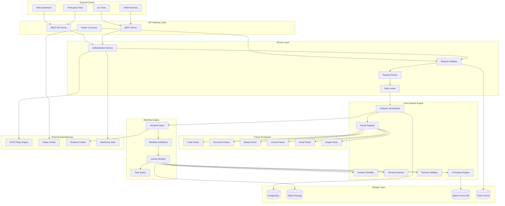
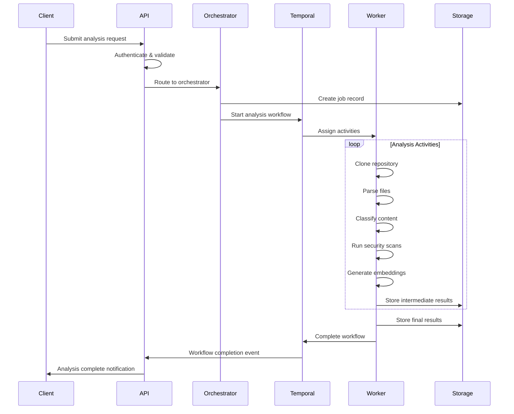

# Repository Analysis Service Architecture

## Table of Contents
- [System Overview](#system-overview)
- [Component Architecture](#component-architecture)
- [Data Flow](#data-flow)
- [Storage Strategy](#storage-strategy)
- [Security Architecture](#security-architecture)
- [Scalability Design](#scalability-design)
- [Integration Points](#integration-points)

## System Overview

The Repository Analysis Service is designed as a microservice that provides comprehensive forensic analysis capabilities for any type of repository. The architecture emphasizes scalability, security, and forensic integrity while supporting multiple access patterns through REST, gRPC, and event-driven interfaces.

### Design Principles

1. **Universal Analysis**: Support any file type with pluggable parser architecture
2. **Forensic Integrity**: Immutable audit trails and chain of custody preservation
3. **Horizontal Scalability**: Stateless processing with distributed workflows
4. **Security First**: Sandboxed execution with comprehensive access controls
5. **Event-Driven**: Reactive architecture with real-time notifications
6. **Temporal Reliability**: Long-running workflows with failure recovery

## Component Architecture



## Component Details

### API Gateway Layer

#### REST API Server
- **Purpose**: HTTP/HTTPS interface for web clients and external integrations
- **Technology**: Axum (Rust) or Gin (Go) with OpenAPI documentation
- **Features**: Request validation, CORS handling, rate limiting, authentication
- **Endpoints**: Analysis submission, status checking, report retrieval, search

#### gRPC Server
- **Purpose**: High-performance interface for internal service communication
- **Technology**: Tonic (Rust) or standard gRPC (Go)
- **Features**: Streaming responses, connection pooling, load balancing
- **Services**: Analysis management, real-time status updates, bulk operations

#### Pulsar Consumer
- **Purpose**: Event-driven processing from other AFDP services
- **Technology**: Apache Pulsar client with automatic acknowledgment
- **Features**: Dead letter queues, retry logic, message deduplication
- **Topics**: Repository events, policy violations, security alerts

### Core Analysis Engine

#### Analysis Orchestrator
```rust
pub struct AnalysisOrchestrator {
    temporal_client: TemporalClient,
    parser_registry: Arc<ParserRegistry>,
    storage_manager: Arc<StorageManager>,
    metrics_collector: Arc<MetricsCollector>,
}

impl AnalysisOrchestrator {
    pub async fn submit_analysis(&self, request: AnalysisRequest) -> Result<AnalysisJob> {
        // Validate request and check permissions
        self.validate_request(&request).await?;
        
        // Create analysis job in database
        let job = self.create_analysis_job(&request).await?;
        
        // Start Temporal workflow
        let workflow_id = format!("analysis-{}", job.id);
        self.temporal_client
            .start_workflow(workflow_id, AnalysisWorkflow, request)
            .await?;
            
        Ok(job)
    }
}
```

#### Parser Registry
- **Purpose**: Centralized management of file type parsers
- **Features**: Dynamic parser loading, format detection, parser chaining
- **Extensibility**: Plugin architecture for custom parsers

#### Content Classifier
- **Purpose**: Automatic categorization of discovered content
- **Technology**: ML models for content classification
- **Categories**: PII, confidential, privileged, evidence, malware

#### Security Scanner
- **Purpose**: Identify security vulnerabilities and threats
- **Features**: Static analysis, dependency scanning, secret detection
- **Engines**: Semgrep, CodeQL, custom rules, YARA scanning

#### AI Analysis Engine
- **Purpose**: Advanced pattern recognition and similarity analysis
- **Features**: Semantic embeddings, anomaly detection, entity extraction
- **Models**: Transformer-based embeddings, clustering algorithms

#### Forensic Validator
- **Purpose**: Ensure forensic integrity and chain of custody
- **Features**: Hash verification, timestamp validation, signature checking
- **Compliance**: Legal admissibility standards, audit trail generation

## Data Flow

### Analysis Request Flow



### File Processing Pipeline

```mermaid
graph LR
    REPO[Repository] --> CLONE[Clone & Validate]
    CLONE --> DISCOVER[File Discovery]
    DISCOVER --> CLASSIFY[Type Classification]
    CLASSIFY --> EXTRACT[Content Extraction]
    EXTRACT --> PARSE[Structured Parsing]
    PARSE --> ANALYZE[Security Analysis]
    ANALYZE --> EMBED[Generate Embeddings]
    EMBED --> CORRELATE[Cross-Reference]
    CORRELATE --> REPORT[Generate Report]
    REPORT --> STORE[Store Results]
```



## Storage Strategy

### PostgreSQL (Relational Data)
```sql
-- Analysis jobs and metadata
CREATE TABLE analysis_jobs (
    id UUID PRIMARY KEY DEFAULT gen_random_uuid(),
    repository_url TEXT NOT NULL,
    repository_type VARCHAR(50) NOT NULL,
    status VARCHAR(50) NOT NULL DEFAULT 'pending',
    created_at TIMESTAMP WITH TIME ZONE DEFAULT NOW(),
    started_at TIMESTAMP WITH TIME ZONE,
    completed_at TIMESTAMP WITH TIME ZONE,
    configuration JSONB NOT NULL,
    metadata JSONB DEFAULT '{}',
    error_message TEXT
);

-- File analysis results
CREATE TABLE file_analyses (
    id UUID PRIMARY KEY DEFAULT gen_random_uuid(),
    job_id UUID REFERENCES analysis_jobs(id),
    file_path TEXT NOT NULL,
    file_type VARCHAR(100) NOT NULL,
    file_size BIGINT NOT NULL,
    content_hash VARCHAR(64) NOT NULL,
    analysis_results JSONB NOT NULL,
    security_findings JSONB DEFAULT '[]',
    created_at TIMESTAMP WITH TIME ZONE DEFAULT NOW()
);

-- Security findings
CREATE TABLE security_findings (
    id UUID PRIMARY KEY DEFAULT gen_random_uuid(),
    file_analysis_id UUID REFERENCES file_analyses(id),
    finding_type VARCHAR(100) NOT NULL,
    severity VARCHAR(20) NOT NULL,
    description TEXT NOT NULL,
    location JSONB, -- line number, column, etc.
    remediation TEXT,
    false_positive BOOLEAN DEFAULT FALSE,
    created_at TIMESTAMP WITH TIME ZONE DEFAULT NOW()
);

-- Audit trail
CREATE TABLE audit_log (
    id UUID PRIMARY KEY DEFAULT gen_random_uuid(),
    job_id UUID REFERENCES analysis_jobs(id),
    action VARCHAR(100) NOT NULL,
    actor VARCHAR(255) NOT NULL,
    details JSONB NOT NULL,
    timestamp TIMESTAMP WITH TIME ZONE DEFAULT NOW()
);
```

### Object Storage (File Data)
```
bucket/
├── repositories/
│   ├── {job_id}/
│   │   ├── source/          # Original repository files
│   │   ├── extracted/       # Extracted content (text, metadata)
│   │   └── artifacts/       # Generated artifacts (graphs, images)
├── reports/
│   ├── {job_id}/
│   │   ├── summary.json     # Executive summary
│   │   ├── detailed.html    # Full HTML report
│   │   ├── evidence.zip     # Evidence package
│   │   └── compliance.pdf   # Compliance report
└── cache/
    ├── parsers/             # Cached parser outputs
    └── embeddings/          # Cached vector embeddings
```

### Qdrant (Vector Embeddings)
```rust
// Collection schema for content embeddings
#[derive(Serialize, Deserialize)]
pub struct ContentEmbedding {
    pub job_id: String,
    pub file_path: String,
    pub content_type: String,
    pub text_content: String,
    pub embedding: Vec<f32>,
    pub metadata: HashMap<String, Value>,
}

// Collection configuration
CollectionConfig {
    vectors: VectorParams {
        size: 768, // BERT-base embedding size
        distance: Distance::Cosine,
    },
    optimizers_config: OptimizersConfig {
        deleted_threshold: 0.2,
        vacuum_min_vector_number: 1000,
        ..Default::default()
    },
}
```

## Security Architecture

### Authentication & Authorization
```rust
#[derive(Debug, Clone)]
pub struct SecurityContext {
    pub user_id: String,
    pub roles: Vec<String>,
    pub permissions: HashSet<String>,
    pub organization_id: String,
    pub clearance_level: Option<String>,
}

pub async fn authenticate_request(
    token: &str,
    policy_engine: &PolicyEngineClient,
) -> Result<SecurityContext> {
    // Validate JWT token with AFDP Policy Engine
    let claims = policy_engine.validate_token(token).await?;
    
    // Check specific permissions for repository analysis
    let permissions = policy_engine
        .get_user_permissions(&claims.user_id)
        .await?;
    
    // Verify clearance level for sensitive repositories
    let clearance = policy_engine
        .get_user_clearance(&claims.user_id)
        .await?;
    
    Ok(SecurityContext {
        user_id: claims.user_id,
        roles: claims.roles,
        permissions: permissions.into_iter().collect(),
        organization_id: claims.organization_id,
        clearance_level: clearance,
    })
}
```

### Sandboxed Execution
```rust
pub struct SandboxConfig {
    pub cpu_limit: String,      // "2"
    pub memory_limit: String,   // "4Gi"
    pub disk_limit: String,     // "10Gi"
    pub network_isolation: bool,
    pub read_only_filesystem: bool,
    pub timeout: Duration,
    pub allowed_syscalls: Vec<String>,
}

pub async fn run_in_sandbox<F, T>(
    config: SandboxConfig,
    operation: F,
) -> Result<T>
where
    F: FnOnce() -> Result<T> + Send + 'static,
    T: Send + 'static,
{
    // Create isolated container/process
    let container = Container::new()
        .with_cpu_limit(&config.cpu_limit)
        .with_memory_limit(&config.memory_limit)
        .with_network_isolation(config.network_isolation)
        .with_readonly_filesystem(config.read_only_filesystem)
        .with_timeout(config.timeout);
    
    // Execute operation in sandbox
    container.run(operation).await
}
```

## Scalability Design

### Horizontal Scaling Strategy

#### Stateless Service Design
- No in-memory state between requests
- All state stored in external systems (PostgreSQL, Object Storage)
- Worker processes can be scaled independently

#### Load Balancing
```yaml
# Kubernetes deployment example
apiVersion: apps/v1
kind: Deployment
metadata:
  name: repository-analysis
spec:
  replicas: 5
  selector:
    matchLabels:
      app: repository-analysis
  template:
    spec:
      containers:
      - name: repo-analysis
        image: afdp/repository-analysis:latest
        resources:
          requests:
            cpu: "1"
            memory: "2Gi"
          limits:
            cpu: "4"
            memory: "8Gi"
        env:
        - name: WORKER_CONCURRENCY
          value: "10"
        - name: MAX_REPO_SIZE
          value: "10GB"
```

#### Queue-Based Processing
```rust
pub struct WorkerPool {
    workers: Vec<Worker>,
    task_queue: Arc<TaskQueue>,
    metrics: Arc<MetricsCollector>,
}

impl WorkerPool {
    pub async fn process_tasks(&self) {
        let mut handles = Vec::new();
        
        for worker in &self.workers {
            let queue = Arc::clone(&self.task_queue);
            let metrics = Arc::clone(&self.metrics);
            
            let handle = tokio::spawn(async move {
                while let Some(task) = queue.pop().await {
                    let start = Instant::now();
                    
                    match worker.process_task(task).await {
                        Ok(_) => {
                            metrics.increment_counter("tasks_completed");
                        }
                        Err(e) => {
                            metrics.increment_counter("tasks_failed");
                            error!("Task processing failed: {}", e);
                        }
                    }
                    
                    metrics.record_duration("task_duration", start.elapsed());
                }
            });
            
            handles.push(handle);
        }
        
        futures::future::join_all(handles).await;
    }
}
```

### Performance Optimization

#### Caching Strategy
```rust
pub struct CacheManager {
    redis: Arc<RedisClient>,
    local_cache: Arc<LruCache<String, CacheEntry>>,
}

impl CacheManager {
    pub async fn get_or_compute<F, T>(
        &self,
        key: &str,
        ttl: Duration,
        compute_fn: F,
    ) -> Result<T>
    where
        F: FnOnce() -> Result<T>,
        T: Serialize + DeserializeOwned + Clone,
    {
        // Check local cache first
        if let Some(entry) = self.local_cache.get(key) {
            if !entry.is_expired() {
                return Ok(entry.value.clone());
            }
        }
        
        // Check Redis cache
        if let Ok(cached) = self.redis.get::<T>(key).await {
            self.local_cache.insert(key.to_string(), CacheEntry::new(cached.clone(), ttl));
            return Ok(cached);
        }
        
        // Compute and cache result
        let result = compute_fn()?;
        
        self.redis.set_ex(key, &result, ttl.as_secs()).await?;
        self.local_cache.insert(key.to_string(), CacheEntry::new(result.clone(), ttl));
        
        Ok(result)
    }
}
```

## Integration Points

### AFDP Policy Engine Integration
```rust
pub struct PolicyEngineClient {
    client: HttpClient,
    base_url: String,
}

impl PolicyEngineClient {
    pub async fn check_repository_access(
        &self,
        user_id: &str,
        repository_url: &str,
    ) -> Result<bool> {
        let request = PolicyEvaluationRequest {
            user_id: user_id.to_string(),
            resource: format!("repository:{}", repository_url),
            action: "analyze".to_string(),
            context: HashMap::new(),
        };
        
        let response = self
            .client
            .post(&format!("{}/api/v1/evaluate", self.base_url))
            .json(&request)
            .send()
            .await?;
        
        let decision: PolicyDecision = response.json().await?;
        Ok(decision.result == "allow")
    }
}
```

### Temporal Workflow Integration
```rust
#[workflow]
pub async fn analysis_workflow(
    input: AnalysisRequest,
) -> Result<AnalysisResult> {
    // Step 1: Clone and validate repository
    let repository = clone_repository_activity(input.repository_url.clone()).await?;
    
    // Step 2: Discover and classify files
    let files = discover_files_activity(repository.path.clone()).await?;
    let classified_files = classify_files_activity(files).await?;
    
    // Step 3: Parse content in parallel
    let parse_tasks: Vec<_> = classified_files
        .chunks(10)
        .map(|chunk| parse_files_activity(chunk.to_vec()))
        .collect();
    let parsed_files = futures::future::try_join_all(parse_tasks).await?;
    
    // Step 4: Security analysis
    let security_findings = security_analysis_activity(
        parsed_files.iter().flatten().cloned().collect()
    ).await?;
    
    // Step 5: AI analysis and correlation
    let ai_analysis = ai_analysis_activity(parsed_files.clone()).await?;
    
    // Step 6: Generate report
    let report = generate_report_activity(GenerateReportInput {
        repository: repository.clone(),
        files: parsed_files.into_iter().flatten().collect(),
        security_findings,
        ai_analysis,
    }).await?;
    
    Ok(AnalysisResult {
        job_id: input.job_id,
        repository,
        report,
        status: AnalysisStatus::Completed,
    })
}
```

### Event Publishing
```rust
pub struct EventPublisher {
    pulsar_producer: Arc<PulsarProducer>,
}

impl EventPublisher {
    pub async fn publish_analysis_event(
        &self,
        event: AnalysisEvent,
    ) -> Result<()> {
        let topic = match event.event_type {
            AnalysisEventType::Submitted => "repo.analysis.submitted",
            AnalysisEventType::Started => "repo.analysis.started",
            AnalysisEventType::ViolationDetected => "repo.violation.detected",
            AnalysisEventType::Completed => "repo.analysis.completed",
        };
        
        let message = PulsarMessage::builder()
            .with_content(serde_json::to_vec(&event)?)
            .with_key(event.job_id.clone())
            .with_properties(HashMap::from([
                ("event_type".to_string(), event.event_type.to_string()),
                ("timestamp".to_string(), event.timestamp.to_rfc3339()),
            ]))
            .build();
        
        self.pulsar_producer
            .send(topic, message)
            .await
            .map_err(|e| anyhow::anyhow!("Failed to publish event: {}", e))?;
        
        Ok(())
    }
}
```

This architecture provides a robust, scalable, and secure foundation for universal repository analysis while maintaining forensic integrity and supporting diverse access patterns.